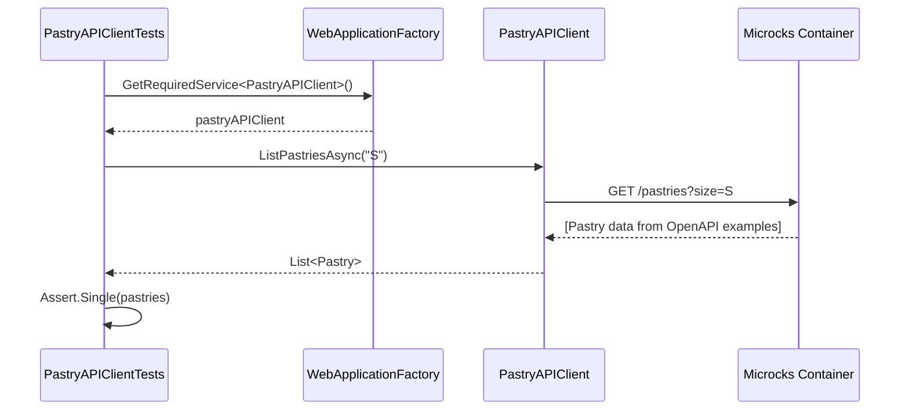
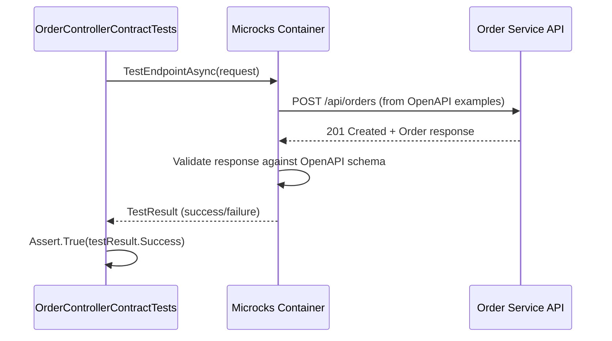

# Step 4: Let's write tests for the REST APIs

So far, we focused on being able to run the application locally without having to install or run any dependent services manually. But there is nothing more painful than working on a codebase without a comprehensive test suite.

Let's fix that!!

## Common Test SetUp

For all the integration tests in our application, we need to use mocks provided by Microcks via .NET Aspire's orchestration capabilities.

### Review OrderHostAspireFactory class under tests/Order.ServiceApi.Tests/Fixture

In .NET Aspire, we use a custom `OrderHostAspireFactory` to provision all required services and inject configuration for local development and testing. This leverages the .NET Aspire distributed application testing infrastructure.

Here's how it works:

* The factory provisions a Microcks container automatically using Aspire's `DistributedApplicationTestingBuilder`.
* It imports all required contract and collection artifacts into Microcks at startup via the AppHost configuration.
* The factory exposes endpoints and injects the correct mock endpoints (e.g., Pastry API) into the application configuration, so your HTTP clients use the simulated endpoints provided by Microcks.
* The test classes implement `IClassFixture<OrderHostAspireFactory>` to share the same Aspire app across all integration tests.

Example:

```csharp
public sealed class OrderHostAspireFactory : IAsyncDisposable
{
    public required MicrocksResource MicrocksResource;
    public DistributedApplication App { get; private set; } = default!;

    public async ValueTask InitializeAsync(ITestOutputHelper testOutputHelper)
    {
        var builder = await DistributedApplicationTestingBuilder
            .CreateAsync<Order_AppHost>(TestContext.Current.CancellationToken);

        // Enable resource logging to see container logs in console
        builder.Services.AddLogging(logging =>
        {
            logging.SetMinimumLevel(LogLevel.Information);
            logging.AddFilter("Aspire.", LogLevel.Debug);
            logging.AddFilter("Aspire.Hosting", LogLevel.Debug);
            logging.AddXUnit(testOutputHelper, options =>
            {
                options.TimestampFormat = "HH:mm:ss.fff ";
                options.IncludeScopes = false;
            });
        });

        this.MicrocksResource = builder.Resources.OfType<MicrocksResource>().Single();
        this.App = await builder.BuildAsync(TestContext.Current.CancellationToken);

        await this.App.StartAsync().ConfigureAwait(true);

        // Wait for microcks readiness
        await this.App.ResourceNotifications.WaitForResourceHealthyAsync(
            MicrocksResource.Name, TestContext.Current.CancellationToken)
            .ConfigureAwait(true);

        // Wait for Order API readiness
        await this.App.ResourceNotifications.WaitForResourceHealthyAsync(
            "order-api", TestContext.Current.CancellationToken)
            .ConfigureAwait(true);
    }
    // ...existing code...
}
```

This setup means you do not need to manually start Microcks, or any other dependencies. The Aspire test factory provisions everything automatically, waits for health checks, and ensures your application uses the simulated services for local development and contract testing.

Let's understand what this configuration class does:

* `OrderHostAspireFactory` wraps the `DistributedApplicationTestingBuilder` to provide a custom test environment for our application using our existing `Order.AppHost` project.
* `InitializeAsync` method is called to set up the test environment before running tests. It builds and starts the distributed application, then waits for all resources to be healthy. In detail:
  * We create a testing builder from our existing `Order_AppHost` project, reusing all the Microcks and service configuration.
  * We configure logging to output to xUnit's test output helper for debugging.
  * We retrieve the `MicrocksResource` from the builder's resources to access mock endpoints.
  * We wait for both Microcks and the Order API to be healthy before running tests.

And that's it! 🎉 You don't need to download and install extra things, or clone other repositories and figure out how to start your dependent services. Aspire orchestrates everything for you.

## First Test - Verify our RESTClient

In this section, we'll focus on testing the `Pastry API Client` component of our application:


Let's review the test class `PastryAPIClientTests` under `tests/Order.ServiceApi.Tests/Client`.

```csharp
public sealed class PastryAPIClientTests(
    OrderHostAspireFactory fixture,
    ITestOutputHelper testOutputHelper)
    : IClassFixture<OrderHostAspireFactory>, IAsyncLifetime
{
    private readonly OrderHostAspireFactory _fixture = fixture;
    private readonly ITestOutputHelper _testOutputHelper = testOutputHelper;

    public WebApplicationFactory<Order.ServiceApi.Program>? WebApplicationFactory { get; private set; }

    [Fact]
    public async Task TestPastryAPIClient_ListPastriesAsync()
    {
        Assert.NotNull(this.WebApplicationFactory);

        // Arrange
        DistributedApplication app = _fixture.App;
        var microcksClient = app.CreateMicrocksClient("microcks");

        var pastryAPIClient = this.WebApplicationFactory
            .Services
            .GetRequiredService<PastryAPIClient>();

        List<Pastry> pastries = await pastryAPIClient.ListPastriesAsync("S", TestContext.Current.CancellationToken);
        Assert.Single(pastries); // Assuming there is 1 pastry in the mock data

        pastries = await pastryAPIClient.ListPastriesAsync("M", TestContext.Current.CancellationToken);
        Assert.Equal(2, pastries.Count); // Assuming there are 2 pastries in the mock

        pastries = await pastryAPIClient.ListPastriesAsync("L", TestContext.Current.CancellationToken);
        Assert.Equal(2, pastries.Count); // Assuming there are 2 pastries in the mock
    }

    [Fact]
    public async Task TestPastryAPIClient_GetPastryByNameAsync()
    {
        Assert.NotNull(this.WebApplicationFactory);

        var pastryAPIClient = this.WebApplicationFactory
            .Services
            .GetRequiredService<PastryAPIClient>();

        // Act & Assert : Millefeuille (available)
        var millefeuille = await pastryAPIClient.GetPastryByNameAsync("Millefeuille", TestContext.Current.CancellationToken);
        Assert.NotNull(millefeuille);
        Assert.Equal("Millefeuille", millefeuille.Name);
        Assert.True(millefeuille.IsAvailable());

        // Act & Assert : Éclair Café (available)
        var eclairCafe = await pastryAPIClient.GetPastryByNameAsync("Eclair Cafe", TestContext.Current.CancellationToken);
        Assert.NotNull(eclairCafe);
        Assert.Equal("Eclair Cafe", eclairCafe.Name);
        Assert.True(eclairCafe.IsAvailable());

        // Act & Assert : Éclair Chocolat (unavailable)
        var eclairChocolat = await pastryAPIClient.GetPastryByNameAsync("Eclair Chocolat", TestContext.Current.CancellationToken);
        Assert.NotNull(eclairChocolat);
        Assert.Equal("Eclair Chocolat", eclairChocolat.Name);
        Assert.False(eclairChocolat.IsAvailable());
    }

    public async ValueTask InitializeAsync()
    {
        await _fixture.InitializeAsync(_testOutputHelper);

        // Get Microcks Pastry API mock endpoint
        var pastryApiUrl = _fixture.MicrocksResource
            .GetRestMockEndpoint("API Pastries", "0.0.1")
            .ToString();

        // Add services for web/integration tests.
        this.WebApplicationFactory = new WebApplicationFactory<Program>()
            .WithWebHostBuilder(builder =>
            {
                builder.UseEnvironment("Test");
                builder.UseSetting("PastryApi:BaseUrl", pastryApiUrl);
            });
    }

    public async ValueTask DisposeAsync()
    {
        if (WebApplicationFactory is not null)
        {
            await WebApplicationFactory.DisposeAsync();
        }
        await _fixture.DisposeAsync();
    }
}
```

If you run this test, it should pass and that means we have successfully configured the application to start with all the required containers and that they're correctly wired to the application. Within this test:

* We're reusing the data that comes from the examples in the `Pastry API` OpenAPI specification and Postman collection.
* The `PastryAPIClient` has been configured with a REST Client that is wired to the Microcks mock endpoints.
* We're validating the configuration of this client as well as all the JSON and network serialization details of our configuration!

The sequence diagram below details the test sequence. Microcks is used as a third-party backend to allow going through all the layers:



### 🎁 Bonus step - Check the mock endpoints are actually used

While the above test is a good start, it doesn't actually check that the mock endpoints are being used. In a more complex application, it's possible that the client is not correctly configured or uses some cache or other mechanism that would bypass the mock endpoints. In order to check that you can actually use the `VerifyAsync()` method available on the Microcks client:

```csharp
[Fact]
public async Task TestPastryAPIClient_ListPastriesAsync()
{
    // Arrange
    DistributedApplication app = _fixture.App;
    var microcksClient = app.CreateMicrocksClient("microcks");

    var pastryAPIClient = this.WebApplicationFactory
        .Services
        .GetRequiredService<PastryAPIClient>();

    List<Pastry> pastries = await pastryAPIClient.ListPastriesAsync("S", TestContext.Current.CancellationToken);
    Assert.Single(pastries); // Assuming there is 1 pastry in the mock data

    pastries = await pastryAPIClient.ListPastriesAsync("M", TestContext.Current.CancellationToken);
    Assert.Equal(2, pastries.Count); // Assuming there are 2 pastries in the mock

    pastries = await pastryAPIClient.ListPastriesAsync("L", TestContext.Current.CancellationToken);
    Assert.Equal(2, pastries.Count); // Assuming there are 2 pastries in the mock

    bool isVerified = await microcksClient.VerifyAsync(
        "API Pastries", "0.0.1", cancellationToken: TestContext.Current.CancellationToken);
    Assert.True(isVerified, "Pastry API should be verified successfully");
}
```

If you need finer-grained control, you can also check the number of invocations with `GetServiceInvocationsCountAsync()`. This way you can check that the mock has been invoked the correct number of times:

```csharp
[Fact]
public async Task TestPastryAPIClient_GetPastryByNameAsync()
{
    // Arrange
    DistributedApplication app = _fixture.App;
    var microcksClient = app.CreateMicrocksClient("microcks");
    double initialInvocationCount = await microcksClient
        .GetServiceInvocationsCountAsync("API Pastries", "0.0.1", cancellationToken: TestContext.Current.CancellationToken);

    var pastryAPIClient = this.WebApplicationFactory
        .Services
        .GetRequiredService<PastryAPIClient>();

    // Act & Assert : Millefeuille (available)
    var millefeuille = await pastryAPIClient.GetPastryByNameAsync("Millefeuille", TestContext.Current.CancellationToken);
    Assert.NotNull(millefeuille);
    Assert.Equal("Millefeuille", millefeuille.Name);
    Assert.True(millefeuille.IsAvailable());

    // Act & Assert : Éclair Café (available)
    var eclairCafe = await pastryAPIClient.GetPastryByNameAsync("Eclair Cafe", TestContext.Current.CancellationToken);
    Assert.NotNull(eclairCafe);
    Assert.Equal("Eclair Cafe", eclairCafe.Name);
    Assert.True(eclairCafe.IsAvailable());

    // Act & Assert : Éclair Chocolat (unavailable)
    var eclairChocolat = await pastryAPIClient.GetPastryByNameAsync("Eclair Chocolat", TestContext.Current.CancellationToken);
    Assert.NotNull(eclairChocolat);
    Assert.Equal("Eclair Chocolat", eclairChocolat.Name);
    Assert.False(eclairChocolat.IsAvailable());

    // Verify invocation count
    double finalInvocationCount = await microcksClient.GetServiceInvocationsCountAsync(
        "API Pastries", "0.0.1", cancellationToken: TestContext.Current.CancellationToken);
    Assert.Equal(initialInvocationCount + 3, finalInvocationCount);
}
```

This is a super powerful way to ensure that your application logic (caching, no caching, etc.) is correctly implemented and uses the mock endpoints when required 🎉

## Second Test - Verify the technical conformance of Order Service API

The 2nd thing we want to validate is the conformance of the `Order API` we'll expose to consumers. In this section and the next one, we'll focus on testing the `OrderEndpoints` component of our application:


## Bonus - Test the exposed HTTP API directly

You can also write an integration test that uses `HttpClient` to invoke the exposed HTTP layer and validate each response with .NET assertions:

```csharp
[Fact]
public async Task Should_Return_Order_When_Post_Order()
{
    // Arrange
    var client = new HttpClient();
    var endpoint = _fixture.App.GetEndpoint("order-api");
    
    var orderRequest = new
    {
        customerId = "lbroudoux",
        productQuantities = new[]
        {
            new { productName = "Millefeuille", quantity = 1 }
        },
        totalPrice = 10.1
    };

    var content = new StringContent(
        JsonSerializer.Serialize(orderRequest),
        Encoding.UTF8,
        "application/json");

    // Act
    var response = await client.PostAsync($"{endpoint}api/orders", content);

    // Assert
    response.EnsureSuccessStatusCode();
    var json = await response.Content.ReadAsStringAsync();
    using var doc = JsonDocument.Parse(json);
    var root = doc.RootElement;

    Assert.True(root.TryGetProperty("id", out _), "id property should exist");
    Assert.True(root.TryGetProperty("status", out _), "status property should exist");
    Assert.True(root.TryGetProperty("productQuantities", out var productQuantities), "productQuantities should exist");
    Assert.Equal(1, productQuantities.GetArrayLength());
}
```

This certainly works but presents 2 problems in my humble opinion:

* It's a lot of code to write! And it applies to each API interaction because for each interaction it's probably a good idea to check the structure of the same objects in the message. This leads to a fair amount of code!
* The code you write here is actually a language-specific translation of the OpenAPI specification for the `Order API`: so the same "rules" get duplicated. Whether you edit the code or the OpenAPI spec first, high are the chances you get some drifts between your test suite and the specification you will provide to consumers!

Microcks Aspire integration provides another approach by letting you reuse the OpenAPI specification directly in your test suite, without having to write assertions and validation of messages for API interaction.

Let's review the test class `OrderControllerContractTests` under `tests/Order.ServiceApi.Tests/Api`:

```csharp
[Fact]
public async Task TestOpenApiContract()
{
    // Arrange
    var app = _fixture.App;
    
    // Use GetEndpointForNetwork with the container network context so that Microcks (running in a container)
    // can access the order-api service from the Aspire container network
    Uri endpoint = app.GetEndpointForNetwork("order-api", KnownNetworkIdentifiers.DefaultAspireContainerNetwork);
    
    TestRequest request = new()
    {
        ServiceId = "Order Service API:0.1.0",
        RunnerType = TestRunnerType.OPEN_API_SCHEMA,
        TestEndpoint = $"{endpoint.Scheme}://{endpoint.Host}:{endpoint.Port}/api",
    };

    var microcksClient = app.CreateMicrocksClient("microcks");
    var testResult = await microcksClient.TestEndpointAsync(request, TestContext.Current.CancellationToken);

    // Assert
    var json = JsonSerializer.Serialize(testResult, new JsonSerializerOptions { WriteIndented = true });
    _testOutputHelper.WriteLine(json);

    Assert.False(testResult.InProgress, "Test should not be in progress");
    Assert.True(testResult.Success, "Test should be successful");
    Assert.Single(testResult.TestCaseResults!);
}
```

Here, we're using a Microcks-provided `TestRequest` object that allows us to specify to Microcks the scope of the conformance test we want to run:

* We ask for testing our endpoint against the service interface of `Order Service API` in version `0.1.0`. These are the identifiers found in the `order-service-openapi.yaml` file.
* We ask Microcks to validate the `OpenAPI Schema` conformance by specifying a `runnerType`.
* We use `GetEndpointForNetwork` with `KnownNetworkIdentifiers.DefaultAspireContainerNetwork` to get an endpoint that Microcks (running in a container) can access. Aspire automatically manages the hostname resolution across all environments (Mac, Windows, Linux, GitHub Actions).

Finally, we're retrieving a `TestResult` from Microcks, and we can assert things on this result, checking it's a success.

The sequence diagram below details the test sequence. Microcks is used as a middleman that actually invokes your API with the example from its dataset:



Our `OrderEndpoints` development is technically correct: all the JSON and HTTP serialization layers have been tested!

## Third Test - Verify the business conformance of Order Service API

The above section allows us to validate the technical conformance but not the business one! Imagine we forgot to record all the requested products in the order or change the total price in resulting order. This could raise some issues!

Microcks allows executing business conformance tests by leveraging Postman Collections. If you're familiar with Postman Collection scripts, you'll open the `order-service-postman-collection.json` file and find some snippets like:

```javascript
pm.test("Correct products and quantities in order", function () {
    var order = pm.response.json();
    var productQuantities = order.productQuantities;
    pm.expect(productQuantities).to.be.an("array");
    pm.expect(productQuantities.length).to.eql(requestProductQuantities.length);
    for (let i=0; i<requestProductQuantities.length; i++) {
        var productQuantity = productQuantities[i];
        var requestProductQuantity = requestProductQuantities[i];
        pm.expect(productQuantity.productName).to.eql(requestProductQuantity.productName);
    }
});
```

This snippet typically describes business constraints telling that a valid order response should have unchanged product and quantities.

### Enable Postman Runner in AppHost

To use the Postman Runner, you first need to enable it in your `AppHost/Program.cs` by calling the `WithPostmanRunner()` method:

```csharp
var microcks = builder.AddMicrocks("microcks")
    .WithMainArtifacts(
        "resources/third-parties/apipastries-openapi.yaml",
        "resources/order-service-openapi.yaml"
    )
    .WithSecondaryArtifacts(
        "resources/order-service-postman-collection.json",
        "resources/third-parties/apipastries-postman-collection.json"
    )
    .WithPostmanRunner(); // 👈 Enable Postman contract-testing support
```

### Test using Postman Runner

You can now validate business conformance using the Postman Collection scripts! Let's review the test class `OrderControllerPostmanContractTests` under `tests/Order.ServiceApi.Tests/Api`:

```csharp
public sealed class OrderControllerPostmanContractTests(
    OrderHostAspireFactory fixture,
    ITestOutputHelper testOutputHelper)
    : IClassFixture<OrderHostAspireFactory>, IAsyncLifetime
{
    private readonly OrderHostAspireFactory _fixture = fixture;
    private readonly ITestOutputHelper _testOutputHelper = testOutputHelper;

    /// <summary>
    /// Tests the Postman Collection contract of the Order API.
    /// This validates business conformance using Postman scripts defined in the collection.
    /// </summary>
    [Fact]
    public async Task TestPostmanCollectionContract()
    {
        // Arrange
        var app = _fixture.App;
        
        // Use GetEndpointForNetwork with the container network context so that Microcks (running in a container)
        // can access the order-api service from the Aspire container network
        Uri endpoint = app.GetEndpointForNetwork("order-api", KnownNetworkIdentifiers.DefaultAspireContainerNetwork);

        // Act - Ask for a Postman Collection script conformance to be launched.
        TestRequest request = new()
        {
            ServiceId = "Order Service API:0.1.0",
            RunnerType = TestRunnerType.POSTMAN, // 👈 Use POSTMAN runner for business conformance
            TestEndpoint = $"{endpoint.Scheme}://{endpoint.Host}:{endpoint.Port}/api",
            Timeout = TimeSpan.FromSeconds(5)
        };

        var microcksClient = app.CreateMicrocksClient("microcks");
        var testResult = await microcksClient.TestEndpointAsync(request, TestContext.Current.CancellationToken);

        // Assert
        var json = JsonSerializer.Serialize(testResult, new JsonSerializerOptions { WriteIndented = true });
        _testOutputHelper.WriteLine(json);

        Assert.False(testResult.InProgress, "Test should not be in progress");
        Assert.True(testResult.Success, "Postman contract test should be successful - check Postman Collection scripts");
        Assert.Single(testResult.TestCaseResults!);
    }

    public async ValueTask InitializeAsync()
    {
        await _fixture.InitializeAsync(_testOutputHelper);
    }

    public async ValueTask DisposeAsync()
    {
        await _fixture.DisposeAsync();
    }
}
```

Comparing to the code in the previous section, the only change here is that we asked Microcks to use a `POSTMAN` runner for executing our conformance test. What happens under the hood is now that Microcks is re-using the collection snippets to put some constraints on API response and check their conformance.

The test sequence is exactly the same as in the previous section. The difference here lies in the type of response validation: Microcks reuses Postman collection constraints.

You're now sure that beyond the technical conformance, the `Order Service` also behaves as expected regarding business constraints.

### 🎁 Bonus step - Verify the business conformance of Order Service API in pure .NET

Even if the Postman Collection runner is a great way to validate business conformance, you may want to do it in pure .NET. This is possible by retrieving the messages exchanged during the test and checking their content. Let's review the `TestOpenAPIContractAndBusinessConformance()` test in class `OrderControllerContractTests` under `tests/Order.ServiceApi.Tests/Api`:

```csharp
[Fact]
public async Task TestOpenAPIContractAndBusinessConformance()
{
    // Arrange
    var app = _fixture.App;
    
    // Use GetEndpointForNetwork with the container network context so that Microcks (running in a container)
    // can access the order-api service from the Aspire container network
    Uri endpoint = app.GetEndpointForNetwork("order-api", KnownNetworkIdentifiers.DefaultAspireContainerNetwork);
    
    TestRequest request = new()
    {
        ServiceId = "Order Service API:0.1.0",
        RunnerType = TestRunnerType.OPEN_API_SCHEMA,
        TestEndpoint = $"{endpoint.Scheme}://{endpoint.Host}:{endpoint.Port}/api",
    };
    
    var microcksClient = app.CreateMicrocksClient("microcks");
    var testResult = await microcksClient.TestEndpointAsync(request, TestContext.Current.CancellationToken);

    // You may inspect complete response object with following:
    var json = JsonSerializer.Serialize(testResult, new JsonSerializerOptions { WriteIndented = true });
    _testOutputHelper.WriteLine(json);

    Assert.False(testResult.InProgress, "Test should not be in progress");
    Assert.True(testResult.Success, "Test should be successful");
    Assert.Single(testResult.TestCaseResults!);

    // You may also check business conformance.
    var messages = await microcksClient.GetMessagesForTestCaseAsync(
        testResult, "POST /orders", TestContext.Current.CancellationToken);
    
    foreach (var message in messages)
    {
        if ("201".Equals(message.Response!.Status))
        {
            // Parse the request and response content as JsonDocument
            var responseDocument = JsonDocument.Parse(message.Response.Content!);
            var requestDocument = JsonDocument.Parse(message.Request!.Content!);

            // Directly access the 'productQuantities' array in both request and response
            var requestProductQuantities = requestDocument.RootElement.GetProperty("productQuantities");
            var responseProductQuantities = responseDocument.RootElement.GetProperty("productQuantities");

            // Compare the number of items in both arrays
            Assert.Equal(requestProductQuantities.GetArrayLength(), responseProductQuantities.GetArrayLength());
            
            for (int i = 0; i < requestProductQuantities.GetArrayLength(); i++)
            {
                // Compare the 'productName' property for each item
                var reqProductName = requestProductQuantities[i].GetProperty("productName").GetString();
                var respProductName = responseProductQuantities[i].GetProperty("productName").GetString();
                Assert.Equal(reqProductName, respProductName);
            }
        }
    }
}
```

This test is a bit more complex than the previous ones, but for the moment it is the only available option in .NET. It first asks for an OpenAPI conformance test to be launched and then retrieves the messages to check business conformance, following the same logic that was implemented into the Postman Collection snippet.

It uses the `GetMessagesForTestCaseAsync()` method to retrieve the messages exchanged during the test and then checks the content. While this is done in pure .NET here, you may use the tool or library of your choice like [Shouldly](https://docs.shouldly.org/), [Reqnroll](https://reqnroll.net/) or others.

You're now sure that beyond the technical conformance, the `Order Service` also behaves as expected regarding business constraints.

## Key differences with Testcontainers approach

| Aspect | Testcontainers | .NET Aspire |
|--------|----------------|-------------|
| **Setup** | Custom `WebApplicationFactory` with manual container setup | Reuse existing `AppHost` project |
| **Container orchestration** | Manual `KafkaBuilder`, `MicrocksContainerEnsemble` | Declarative in `AppHost/Program.cs` |
| **Port exposure** | `ExposeHostPortsAsync` + manual port allocation | `WithHostNetworkAccess()` built-in |
| **Mock endpoint access** | `container.GetRestMockEndpoint()` | `resource.GetRestMockEndpoint()` |
| **Testing client** | Direct container access | `app.CreateMicrocksClient("microcks")` |
| **Health checks** | Manual polling | Built-in `WaitForResourceHealthyAsync` |
| **Logging** | Manual setup | Integrated with xUnit via Aspire |

## Summary

With .NET Aspire integration:

1. ✅ **No duplication** - Reuse your `AppHost` configuration for tests
2. ✅ **Automatic orchestration** - All dependencies started and health-checked automatically
3. ✅ **Contract testing** - Validate OpenAPI conformance without writing assertion code
4. ✅ **Postman Runner** - Validate business conformance using Postman Collection scripts
5. ✅ **Mock verification** - Ensure your code actually calls the mock endpoints
6. ✅ **Business conformance** - Validate business rules using message inspection or Postman scripts

[Next](step-5-write-async-tests.md)
