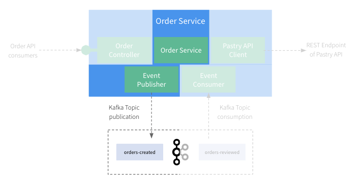
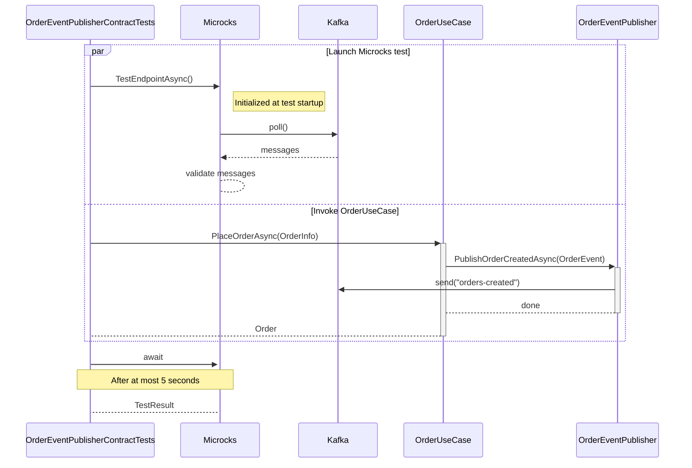
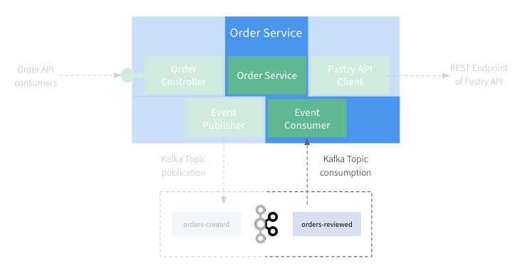

# Step 5: Let's write tests for the Async Events

Now that we address the REST/Synchronous part, let's have a look on the part related to Asynchronous Kafka events.
Testing of asynchronous or event-driven system is usually a pain for developers 🥲

## First Test - Verify our OrderService is publishing events

In this section, we'll focus on testing the `Order Service` + `Event Publisher` components of our application:



Even if it may be easy to check that the creation of an event object has been triggered with frameworks like [FakeItEasy](https://fakeiteasy.github.io/)
or others, it's far more complicated to check that this event is correctly serialized, sent to a broker and valid
regarding an Event definition...

Fortunately, Microcks and Aspire make this thing easy!

Let's review the test class `OrderEventPublisherContractTests` under `tests/Order.ServiceApi.Tests/UseCases` and the `PublishesOrderCreatedEvent_WhenOrderIsPlaced()` 
method:

```csharp
[Collection("DisableParallelization")]
public class OrderEventPublisherContractTests(ITestOutputHelper testOutputHelper) : IAsyncLifetime
{
    private readonly ITestOutputHelper _testOutputHelper = testOutputHelper;
    private DistributedApplication? _app;
    
    // [...] Initialization omitted for brevity
    // See full code for IAsyncLifetime implementation where we start the Aspire AppHost

    [Fact]
    public async Task PublishesOrderCreatedEvent_WhenOrderIsPlaced()
    {
        // Arrange
        await EnsureTopicExistsAsync("orders-created")
            .ConfigureAwait(true);

        // Prepare a Microcks test request
        var kafkaTest = new TestRequest
        {
            ServiceId = "Order Events API:0.1.0",
            FilteredOperations = ["SUBSCRIBE orders-created"],
            RunnerType = TestRunnerType.ASYNC_API_SCHEMA,
            // We use the internal Docker port for communicating with Kafka
            TestEndpoint = "kafka://kafka:9093/orders-created",
            Timeout = TimeSpan.FromSeconds(5)
        };

        var info = new OrderInfo
        {
            CustomerId = "123-456-789",
            ProductQuantities =
            [
                new ProductQuantity("Millefeuille", 1),
                new ProductQuantity("Eclair Cafe", 1)
            ],
            TotalPrice = 8.4
        };

        // Create MicrocksClient
        var microcksClient = _app!.CreateMicrocksClient("microcks");

        // Launch the Microcks test and wait a bit to be sure it actually connects to Kafka.
        var testRequestTask = microcksClient.TestEndpointAsync(kafkaTest, TestContext.Current.CancellationToken);
        await Task.Delay(750, TestContext.Current.CancellationToken);

        // Get the OrderUseCase from WebApplicationFactory services
        var orderUseCase = this.WebApplicationFactory!.Services.GetRequiredService<OrderUseCase>();

        // Invoke the application to create an order.
        var createdOrder = await orderUseCase.PlaceOrderAsync(
            info,
            TestContext.Current.CancellationToken);

        // Get the Microcks test result.
        var testResult = await testRequestTask;

        // Check success and that we read 1 valid message on the topic.
        Assert.True(testResult.Success, "Microcks test should succeed.");
        Assert.NotEmpty(testResult.TestCaseResults!);
        Assert.Single(testResult.TestCaseResults![0].TestStepResults!);

        // Check the content of the emitted event, read from Kafka topic.
        var events = await microcksClient.GetEventMessagesForTestCaseAsync(
            testResult, "SUBSCRIBE orders-created", TestContext.Current.CancellationToken);
        Assert.Single(events);
    }
}
```

Things are a bit more complex here, but we'll walk through step-by-step:
* Similarly to previous section, we initialized the Aspire `DistributedApplication` and retrieved the `MicrocksClient` helper.
* We prepared a Microcks-provided `TestRequest` object
  * We ask for a `AsyncAPI Schema` conformance test that will use the definition found into the `order-events-asyncapi.yaml` contract,
  * We ask Microcks to listen to the `kafka://kafka:9093/orders-created` endpoint that represents the `orders-created` topic on our Kafka broker managed by Aspire (it uses the internal Docker port `9093`),
  * We ask to focus on a specific operation definition to mimic consumers that subscribe to the  `orders-created` channel,
  * We specified a timeout value that means that Microcks will only listen during 5 seconds for incoming messages. 
* We also prepared an `OrderInfo` object that will be used as the input of the `PlaceOrderAsync()` method invocation on `OrderUseCase`.
* Then, we launched the test on the Microcks side. This time, the launch is asynchronous, so we received a `Task` that will give us a `TestResult` later on
  * We wait a bit here to ensure, Microcks got some time to start the test and connect to Kafka broker.
* We can invoke our business service by creating an order with `PlaceOrderAsync()` method. We could assert whatever we want on created order as well.
* Finally, we wait for the task completion to retrieve the `TestResult` and assert on the success and check we received 1 message as a result.

The sequence diagram below details the test sequence. You'll see 2 parallel blocks being executed:
* One that corresponds to Microcks test - where it connects and listen for Kafka messages,
* One that corresponds to the `OrderUseCase` invocation that is expected to trigger a message on Kafka.



Because the test is a success, it means that Microcks has received an `OrderEvent` on the specified topic and has validated the message
conformance with the AsyncAPI contract or this event-driven architecture. So you're sure that all your .NET configuration, Kafka JSON serializer
configuration and network communication are actually correct!

### 🎁 Bonus step - Verify the event content

So you're now sure that an event has been sent to Kafka and that it's valid regarding the AsyncAPI contract. But what about the content
of this event? If you want to go further and check the content of the event, you can do it by asking Microcks the events read during the 
test execution and actually check their content. This can be done adding a few lines of code:

```csharp
[Fact]
public async Task PublishesOrderCreatedEvent_WhenOrderIsPlaced()
{
    // [...] Unchanged comparing previous step.

    // Check the content of the emitted event, read from Kafka topic.
    var events = await microcksClient.GetEventMessagesForTestCaseAsync(
        testResult, "SUBSCRIBE orders-created", TestContext.Current.CancellationToken);
    Assert.Single(events);

    var message = events[0].EventMessage;
    // Deserialize the JSON content as a Dictionary
    var messageMap = JsonSerializer.Deserialize<Dictionary<string, object>>(message!.Content!);
    Assert.NotNull(messageMap);
    
    // Properties from the event message should match the order.
    Assert.True(messageMap.TryGetValue("changeReason", out var changeReason));
    Assert.Equal("Creation", changeReason?.ToString());
    
    Assert.True(messageMap.TryGetValue("order", out var orderObj));
    var orderElement = (JsonElement)orderObj!;
    var orderDict = JsonSerializer.Deserialize<Dictionary<string, object>>(orderElement.GetRawText());
    
    Assert.True(orderDict.TryGetValue("customerId", out var customerId));
    Assert.Equal("123-456-789", customerId?.ToString());
}
```

Here, we're using the `GetEventMessagesForTestCaseAsync()` method on the helper to retrieve the messages read during the test execution.
Using the wrapped `EventMessage` class, we can then check the content of the message and assert that it matches the order we've created.

## Second Test - Verify our OrderEventConsumer is processing events

In this section, we'll focus on testing the `Event Consumer` + `Order Service` components of our application:



The final thing we want to test here is that our `OrderEventConsumerHostedService` component is actually correctly configured for connecting to Kafka,
for consuming messages, for de-serializing them into correct C# objects and for triggering the processing on the `OrderUseCase`.
That's a lot to do and can be quite complex! But things remain very simple with Microcks 😉

Let's review the test class `OrderEventListenerTests` under `tests/Order.ServiceApi.Tests/UseCases` and the `TestEventIsConsumedAndProcessedByService()`
method:

```csharp
[Collection("DisableParallelization")]
public class OrderEventListenerTests : IAsyncLifetime
{
    private readonly ITestOutputHelper _testOutputHelper;
    private DistributedApplication? _app;
    
    // [...] Initialization omitted for brevity

    [Fact]
    public async Task TestEventIsConsumedAndProcessedByService()
    {
        // Arrange
        const string expectedOrderId = "123-456-789";
        const string expectedCustomerId = "lbroudoux";
        const int expectedProductCount = 2;

        // Retrieve MicrocksAsyncMinionResource from application to get the dynamic topic name
        var appModel = _app!.Services.GetRequiredService<DistributedApplicationModel>();
        var microcksAsyncMinionResource = appModel.Resources
            .OfType<MicrocksAsyncMinionResource>()
            .SingleOrDefault();

        // Get the Kafka topic used by Microcks to publish mocks
        string kafkaTopic = microcksAsyncMinionResource!
            .GetKafkaMockTopic("Order Events API", "0.1.0", "SUBSCRIBE orders-reviewed");

        _testOutputHelper.WriteLine($"Consuming from mock topic: {kafkaTopic}");

        // We reconfigure the factory to listen to the specific Microcks topic
        // And ensure we have the correct Kafka connection string
        // ... (see full source for WebApplicationFactory reconfiguration)

        // The OrderEventConsumerHostedService is automatically started by WebApplicationFactory
        // Get the OrderUseCase from WebApplicationFactory services
        var orderUseCase = this.WebApplicationFactory.Services.GetRequiredService<OrderUseCase>();
        OrderModel? order = null;

        // Act & Assert - Poll until the order is processed by the HostedService
        try
        {
            Await()
                .AtMost(TimeSpan.FromSeconds(8))
                .PollDelay(TimeSpan.FromMilliseconds(400))
                .PollInterval(TimeSpan.FromMilliseconds(400))
                .Until(() =>
                {
                    try
                    {
                        var retrievedOrder = orderUseCase.GetOrderAsync(expectedOrderId, TestContext.Current.CancellationToken).GetAwaiter().GetResult();
                        if (retrievedOrder != null)
                        {
                            _testOutputHelper.WriteLine($"Order {retrievedOrder.Id} successfully processed!");
                            order = retrievedOrder;
                            return true;
                        }
                        return false;
                    }
                    catch (OrderNotFoundException)
                    {
                        return false;
                    }
                });

            Assert.NotNull(order);
            // Verify the order properties match expected values
            Assert.Equal(expectedCustomerId, order.CustomerId);
            Assert.Equal(OrderStatus.Validated, order.Status);
            Assert.Equal(expectedProductCount, order.ProductQuantities.Count);
        }
        catch (TimeoutException)
        {
            Assert.Fail("The expected Order was not received/processed in expected delay");
        }
    }
}
```

To fully understand this test, remember that as soon as you're launching the test, Microcks
is immediately starting publishing mock messages on this broker.

The important things to get in this test are:
* We retrieve the Kafka topic name dynamically from `MicrocksAsyncMinionResource` using `GetKafkaMockTopic()`. This is because Microcks might use a different topic name for mocking (adding a suffix to avoid collisions).
* We're using [Awaitility](https://github.com/awaitility/Awaitility.NET) to wait at most 8 seconds for the side effect to happen.
* Within each polling iteration, we're checking for the order with id `123-456-789` because these are the values defined within the `order-events-asyncapi.yaml` AsyncAPI contract examples
* If we retrieve this order and get the correct information from the service, it means that is has been received and correctly processed!
* If no message is found before the end of 8 seconds, the loop exits with a `TimeoutException` and we mark our test as failed.

The sequence diagram below details the test sequence. You'll see 3 parallel blocks being executed:
* The first corresponds to Microcks mocks - where it connects to Kafka, creates a topic and publishes sample messages each 3 seconds,
* The second one corresponds to the `OrderEventListener` invocation that should be triggered automatically by `OrderEventConsumerHostedService` when a message is found in the topic,
* The third one corresponds to the actual test - where we check that the specified order has been found and processed by the `OrderService`. 

```mermaid
sequenceDiagram
  par On test startup
    loop Each 3 seconds
      participant Microcks
      Note right of Microcks: Initialized at test startup
      Microcks->>Kafka: send("orders-reviewed")
    end
  and Consumer execution
    OrderEventConsumerHostedService->>Kafka: poll()
    Kafka-->>OrderEventConsumerHostedService: messages
    OrderEventConsumerHostedService->>+OrderEventProcessor: ProcessOrderEventAsync()
    OrderEventProcessor->>+OrderUseCase: UpdateReviewedOrderAsync()
    OrderUseCase-->OrderUseCase: update order status
    OrderStatus->>-OrderEventProcessor: done
    OrderEventProcessor->>-OrderEventConsumerHostedService: done
  and Test execution
    Note over OrderUseCase,OrderEventListenerTests: At most 8 seconds
    loop Each 400ms
      OrderEventListenerTests->>+OrderUseCase: GetOrderAsync("123-456-789")
      OrderUseCase-->-OrderEventListenerTests: order or throw OrderNotFoundException
      alt Order "123-456-789" found
        OrderEventListenerTests-->OrderEventListenerTests: assert and break;
      else Order "123-456-789" not found
        OrderEventListenerTests-->OrderEventListenerTests: continue;
      end
    end
    Note over OrderUseCase,OrderEventListenerTests: If here, it means that we never received expected message
    OrderEventListenerTests-->OrderEventListenerTests: fail();
  end
```

You did it and succeed in writing integration tests for all your application component with minimum boilerplate code! 🤩 


## Wrap-up

Thanks a lot for being through this quite long demonstration. We hope you learned new techniques for integration tests with both REST and Async/Event-driven APIs. Cheers! 🍻